# Research index

This directory is the project's primary-source evidence locker: write-ups, analysis
scripts, and raw result dumps for every question `progress.md` references by name (Q4,
Q9, Q14, ...). The house rule that governs everything here is the same one that governs
the whole repo: **verify against real telemetry or source before trusting a claim, and
say so plainly when a result is inconclusive rather than rounding it up.** That rule
exists because it was violated once — two early AI-research passes
(`Rigorous_Subaru_Preglobal_CAN_and_UDS_Research.md`, `Subaru_CAN_Reverse_Engineering.md`,
both since excised, see `claude.md`) contained fabricated "verbatim quotes" that read as
authoritative and weren't. Every file below either cites the exact code/DBC/CAN capture
it's based on, or is explicit about being Discord-sourced and how far that can be trusted.

## How to read the map below

The flowchart traces *lineage* — which finding motivated which follow-up — not just a
file listing. Color/style marks how much weight a result can bear:

- 🟩 **green** — confirmed against real telemetry, source, or a live on-car test; shipped
  or safe to rely on.
- 🟨 **amber** — genuinely still open: inconclusive, unresolved, or a design that hasn't
  been implemented/tested yet.
- ⬜ **grey (dashed)** — dead end or ruled out. Useful to know *not* to re-try, not a
  live lead.
- 🟦 **blue** — a pre-registration / protocol / draft patch: a plan committed *before*
  the data that would judge it, not a finding itself.

```mermaid
flowchart TD
  classDef confirmed fill:#2e7d4f,stroke:#1b4d31,color:#ffffff,stroke-width:1px
  classDef open fill:#b8860b,stroke:#7a5a05,color:#ffffff,stroke-width:1px
  classDef deadend fill:#7a7a7a,stroke:#4d4d4d,color:#ffffff,stroke-width:1px,stroke-dasharray: 4 3
  classDef design fill:#3a5a9c,stroke:#20325c,color:#ffffff,stroke-width:1px

  subgraph LEGEND["Legend"]
    direction LR
    L1["confirmed / shipped"]:::confirmed
    L2["open / inconclusive"]:::open
    L3["dead end / ruled out"]:::deadend
    L4["pre-registration / draft / design-only"]:::design
  end

  subgraph P123["Phase 1-3: button emulation (Q4 -> Q6 -> Q10 -> live actuation)"]
    direction TB
    ESFIND["es_distance_cruise_button_finding.md<br/>ES_Distance already carries Cruise_Button,<br/>already TX-allowed, zero firmware change needed"]:::confirmed
    ESCORR["es_distance_correlation.py / _results.json<br/>592 real presses -> Cruise_Button mapping<br/>confirmed at production scale"]:::confirmed
    LT1["es_distance_live_test_protocol.md<br/>+ es_distance_button_test.patch<br/>RESULT: v2 fired live on the wire, Q6 CLOSED"]:::confirmed
    LT3["es_distance_live_test_protocol_v3.md<br/>+ es_distance_button_test_v3.patch<br/>deep-SET / RESUME / burst all fired clean, Q10 CLOSED"]:::confirmed
    CADENCE["button_cadence_response_curve.md<br/>archive-mined cadence -> MIN_COMMAND_INTERVAL_S=0.4s shipped"]:::confirmed
    ICBMRM["icbm_roadmap_research.md<br/>no universal cadence exists; SLF named as the real gap"]:::confirmed
    LEADWARN["lead_vehicle_warning_analysis.md<br/>+ analyze_lead_warning.py / raw_results.json<br/>vision sees closing leads 0.7-31.6s early"]:::confirmed
    TTC["ttc_threshold_grounding.md<br/>5.0s TTC grounded from NHTSA + openpilot FCW<br/>(not the exact trigger ultimately shipped)"]:::open
    BACKTEST["lead_closing_trigger_backtest.md<br/>22% precision; ship existing trigger as-is"]:::confirmed
    LEADPREC["lead_actuation_discord_precedent.md<br/>cadence wisdom folded into shipped 1s->0.4s design"]:::confirmed
    TS["tailscale_findings.md<br/>installed + boot-persistent; carried the v3 live test"]:::confirmed
    PCD["phase3_controller_design.md<br/>curve+lead controller: DESIGNED, IMPLEMENTED,<br/>DEPLOYED, live-armed on the car"]:::confirmed
    SLF["phase3_speed_limit_following_design.md<br/>3rd feature: DESIGN ONLY, never implemented"]:::design

    ESFIND --> ESCORR --> LT1 --> LT3 --> CADENCE
    LEADWARN --> BACKTEST
    TTC -.-> BACKTEST
    LEADPREC -.-> CADENCE
    TS -.->|carried the live test| LT3
    CADENCE --> PCD
    BACKTEST --> PCD
    ICBMRM --> PCD
    ICBMRM --> SLF
    PCD --> SLF
  end

  subgraph COMM["Community / Discord archaeology + Phase 2 dead-end recon (Q9)"]
    direction TB
    Q9F["q9_findings.md<br/>UDS 0x28 silence: no preglobal precedent<br/>(Q9 later closed NO via live device test)"]:::deadend
    CAMBUS["cruise_control_camera_bus_check.md<br/>+ bus_check_script.py<br/>0x144 IS on bus 2, but injection itself untested"]:::open
    BUS2["bus2_injection_precedent.md<br/>no clean precedent either way"]:::open
    ISOMOD["modern_eyesight_isolation_attempts.md<br/>relay isolation is GLOBAL-only; preglobal has no relay"]:::deadend
    HW4["comma4_bus_isolation_hw4.md<br/>no modern Giraffe-equivalent exists or was built"]:::deadend
    XFER["transferable_bus_isolation_techniques.md<br/>fwd_hook blocking is real (Toyota) but unverified for Subaru"]:::open
    PEDAL["pedal_interceptor_findings.md<br/>not needed - stop-and-go already covers it in software"]:::deadend
    FREESSM["freessm_ssm3_protocol_research.md<br/>real SSM write capability found, no target address"]:::open
    RCTRL["routine_control_other_ecu_research.md<br/>RoutineControl itself dead; surfaced the ES_Distance lead"]:::deadend
    NHTSA["ssm_active_test_nhtsa_verification.md<br/>real doc, wrong platform, cosmetic dash test only"]:::deadend
    FORKPREC["preglobal_long_fork_precedent.md<br/>full-longitudinal history: nobody's shipped it for preglobal"]:::deadend
    UI["ui_improvement_ideas.md<br/>ideas catalogued from Discord, none built"]:::open

    RCTRL -.->|surfaced the ES_Distance lead| ESFIND
    Q9F -.-> CAMBUS -.-> BUS2
  end

  subgraph SAFE["Safety / firmware research"]
    direction TB
    TXDRAFT["phase3_tx_allowlist_draft.md + .patch<br/>Q5: 0x144 allowlist patch drafted, NEVER applied"]:::design
  end

  subgraph Q14["Q14: Cruise_Throttle continuous-command channel investigation"]
    direction TB
    THR["eyesight_throttle_channel.md<br/>hypothesis: continuous command channel<br/>already TX-allowed, zero firmware change needed"]:::open
    ARCH["preglobal_longitudinal_command_archaeology.md<br/>parallel: verbatim Discord testimony -<br/>EyeSight faults on wholesale throttle rewrite"]:::confirmed
    PANDA["panda_safety_firmware_deployability.md<br/>parallel: Q5 revised - SOFT blocker,<br/>git-pull + reboot deployable, no factory reset"]:::confirmed
    HYP["es_longitudinal_command_hypothesis.md<br/>+ es_longitudinal_command_correlation.py<br/>pre-registered CONFIRM/KILL test design"]:::design
    RES1["es_longitudinal_command_results.md<br/>+ .json, es_echo_focus.py, es_rpm_focus.py<br/>H1 survives kill test but not confirmed; H3 reversed"]:::open
    FOLLOW["es_stage0_followup_results.md<br/>+ es_perception_focus.py, es_component1_magnitude_extract.py<br/>C5 falsifies echo-class; perception test INCONCLUSIVE"]:::open
    PREREG2["es_stage0_prereg_round2.md<br/>Test A (archive retest) + Test B (capture drive) fixed in advance"]:::design
    R1["es_stage0_round1_testA_results.md<br/>+ es_perception_flatbase_test.py<br/>INCONCLUSIVE - real near-miss, not muddy"]:::open
    R2PRE["es_stage0_round2_rpm_prereg.md<br/>Cruise_RPM perception-impulse test, fixed in advance"]:::design
    R2["es_stage0_round2_rpm_results.md<br/>+ es_perception_flatbase_rpm_test.py<br/>NULL - Cruise_RPM does not lead causally"]:::deadend
    R3PRE["es_stage0_round3_brake_prereg.md<br/>ES_Brake wide-lag + perception test, fixed in advance"]:::design
    R3["es_stage0_round3_brake_results.md<br/>+ es_brake_focus.py, es_perception_flatbase_brake_test.py<br/>CONFIRM - cleanest of the campaign,<br/>but field is NOT TX-writable without firmware change"]:::confirmed
    R4["es_stage0_round4_crossfield_results.md<br/>+ es_crossfield_focus.py<br/>exploratory: neither corroborates nor undermines R3"]:::open
    R5["es_stage0_round5_envelope_completion_results.md<br/>+ es_round5_envelope_completion.py<br/>transfer curves completed; descriptive, not a verdict"]:::open
    SYNTH["es_stage0_campaign_synthesis.md<br/>archive campaign EXHAUSTED - diminishing returns;<br/>command-vs-report question still open"]:::open
    CAPPROTO["es_capture_drive_protocol.md<br/>Test B + Test C protocol for real drives, fixed in advance"]:::design
    CAP1["es_capdrive1_results.md<br/>+ es_capdrive1_ct_test.py, _rpm_test.py, testB.py<br/>drive #1: N far below power floor, ONGOING"]:::open

    THR --> ARCH --> HYP
    THR --> PANDA --> HYP
    TXDRAFT -.->|superseded by| PANDA
    HYP --> RES1 --> FOLLOW --> PREREG2
    PREREG2 --> R1 --> R2PRE --> R2 --> R3PRE --> R3 --> R4 --> R5 --> SYNTH
    PREREG2 -.-> CAPPROTO
    SYNTH --> CAPPROTO --> CAP1
  end
```

**Reading the two "surprise" edges:** `routine_control_other_ecu_research.md` set out to
check UDS RoutineControl and came back empty — but a side comment it surfaced (a DBC-name
mismatch on `0x161`) is what actually led to `es_distance_cruise_button_finding.md`, the
single most consequential discovery in the button-emulation cluster. And
`phase3_tx_allowlist_draft.md` (the original, cautious Q5 patch) turned out to be based on
an overstated blocker — `panda_safety_firmware_deployability.md`, written two weeks later
for a completely different question (Q14), incidentally found the real panda firmware wall
is much softer than the draft assumed.

---

## Button emulation / ICBM mechanism (Phase 1-3)

| File | What it actually found | Status |
|---|---|---|
| `es_distance_cruise_button_finding.md` | `ES_Distance` (`0x161`), not `CruiseControl` (`0x144`), already carries a 3-bit `Cruise_Button` field (`2`/`3`=SET shallow/deep, `4`/`5`=RESUME shallow/deep) — already TX-allowed, already transmitted every drive for steering, no firmware change needed. Redirected the whole project off the `0x144` dead end. | Confirmed / shipped |
| `es_distance_correlation.py` + `es_distance_correlation_results.json` | Passive correlation of 592 real button presses against `Cruise_Button`: 98-99.5% land exactly on the DBC-documented value. Shallow-vs-deep magnitude explicitly **not** resolved by this pass (contamination from multi-press windows). | Confirmed (mapping) / open (magnitude) |
| `es_distance_live_test_protocol.md` + `es_distance_button_test.patch` | v2 test fired for real at 28.9mph: software-commanded `cruise_button=2` made the real ECU engage cruise within ~100ms, matching `vEgo` almost exactly. First confirmed actuation of the whole project. Test code reverted off the device same session. | Confirmed / test code not standing |
| `es_distance_live_test_protocol_v3.md` + `es_distance_button_test_v3.patch` | Deep-SET, 3x burst, and RESUME all tested live in one drive: confirms button presses **nudge** the target, not re-baseline it to current speed. Burst finding: 3 presses ~50ms apart collapse to one effective press (ECU debounce). | Confirmed / test code reverted |
| `button_cadence_response_curve.md` | Archive-mined 87 clean bursts: no debounce collapse from 200ms out to several seconds. Also found (caveat) that passively-observed magnitude is unreliable for shallow-vs-deep (37/38 samples read 5mph regardless of coded value). | Confirmed (timing) / open (magnitude) — shipped `0.4s` interval |
| `icbm_roadmap_research.md` | Stock openpilot has no ICBM equivalent; sunnypilot's own official ICBM has zero Subaru implementations, any generation. Honda's official cadence (50ms) is exactly what causes debounce collapse on this Subaru — confirms cadence must be empirically tuned per-car, not borrowed. | Confirmed |
| `lead_vehicle_warning_analysis.md` + `analyze_lead_warning.py` / `lead_warning_raw_results.json` | Mined 124 routes: in all 14 real historical brake-required episodes, the vision model detected the closing lead 0.7-31.6s beforehand (median ~7.8s). `fcw` never fired once — ruled out as a usable trigger. | Confirmed / shipped as `LeadClosingAdvisory` |
| `ttc_threshold_grounding.md` | Grounds a 5.0s TTC threshold against NHTSA's heavy-vehicle FCW standard and openpilot's own FCW horizon. Not the exact mechanism ultimately shipped (see backtest below). | Open / reference only |
| `lead_closing_trigger_backtest.md` | Backtested the shipped trigger (`vRel<-3.0m/s`) against 63 real episodes: 22% precision. No single feature (vRel/dRel/vEgo/TTC) separates brake-needed from benign episodes better. Recommends shipping as-is since it's a reversible nudge, not an alarm. False-negative rate explicitly left uncomputed. | Confirmed — informed shipped design |
| `lead_actuation_discord_precedent.md` | Confirms the "braking too late" complaint is shared community-wide (independent question asked 8 days prior). Real precedent that rapid button spam causes overshoot; corroborates the ~1s-scale cadence choice. | Confirmed |
| `phase3_controller_design.md` | Full curve+lead controller design: policy, rate limiting, override-latch architecture, staged rollout. **Implemented, deployed, and live-armed on the device** (per `progress.md`) — real bugs found and fixed via shadow-mode verification and live drives (budget exhaustion, baseline-speed race condition). | Confirmed / shipped |
| `phase3_speed_limit_following_design.md` | Third Phase 3 feature design (auto-adjust to posted limits + buffer). Works through a real open design question (distinguishing a preference-correction button press from a stop-everything press) but flags the RESUME-attribution logic as having a real bug found on review. | Design only — never implemented |
| `tailscale_findings.md` | Installed and boot-persistent via a `launch_env.sh` hook (cron/systemd approaches both failed — `/var` is `tmpfs`, wiped every reboot). Verified working over a phone hotspot with direct P2P, not just DERP relay. Carried the v3 live test's live monitoring. | Confirmed / shipped infra |

## Cruise_Throttle / Q14 continuous-command investigation

| File | What it actually found | Status |
|---|---|---|
| `eyesight_throttle_channel.md` | Source-verified: `ES_Distance` already carries `Cruise_Throttle` (bits 0-12), already re-transmitted at 20Hz with **zero panda value checks**. Reframes the whole "can we get real longitudinal control" question — the channel already exists, unwritten. | Open (architecture confirmed, whether the ECU obeys it is not) |
| `preglobal_longitudinal_command_archaeology.md` | Verbatim-verified 2020 Discord testimony: two independent preglobal owners who tried writing this trio got EyeSight faults (`bugsy924`'s own code recovered and diffed; `aileron.me`'s TSB-log confirmed). Key nuance found: EyeSight cross-checks its own commanded throttle against the engine's echo and faults on mismatch — a small/brief deviation was never actually tested by either historical attempt. | Confirmed (archaeology itself); underlying question stays open |
| `panda_safety_firmware_deployability.md` | Revises Q5: there is **no signing wall** (debug RSA key is committed in the panda repo), this car already runs debug-signed firmware by necessity, and firmware ships as a git-tracked binary that `pandad` reflashes on every boot. Modified safety firmware reaches the device via `git pull` + reboot — no factory reset. | Confirmed |
| `es_longitudinal_command_hypothesis.md` + `es_longitudinal_command_correlation.py` | Pre-registered CONFIRM/KILL test design (H1/H2/H3 for throttle/brake/RPM) with a runnable, never-yet-run script. Written and committed before any data was looked at. | Design / pre-registration |
| `es_longitudinal_command_results.md` + `es_longitudinal_command_results.json`, `es_echo_focus.py`, `es_rpm_focus.py` | First real run (282 routes, 3,920 segments): the cheapest kill test (K1) does not fire for `Cruise_Throttle` anywhere. Transfer-function evidence is very clean (anchors match global's constants) but lead/lag evidence is weak and heterogeneous — does not cleanly separate command from report. `Cruise_RPM`'s pre-registered "most likely dead" prediction reversed to "most tightly coupled, command-direction." | Open — survives its kill test, not confirmed |
| `es_stage0_followup_results.md` + `es_perception_focus.py`, `es_component1_magnitude_extract.py` | `Cruise_Throttle` is inert (pinned at 808, n=122,037) while ACC is off — falsifies the "echo of engine signal" hypothesis class outright. New perception-trigger test came back INCONCLUSIVE — the `Car_Follow` trigger itself isn't exogenous (already contaminated by CT's own pre-flip response). T5 stratification found real structure (opposite-sign behavior at different operating points) but is explicitly flagged as hypothesis-generating only, not evidence. | Open |
| `es_stage0_prereg_round2.md` | Fixes CONFIRM/NULL criteria in writing for two follow-up tests (archive retest + a real capture drive) before either has run. | Design / pre-registration |
| `es_stage0_round1_testA_results.md` + `es_perception_flatbase_test.py` / `..._results.json` | Test A run exactly as specified: `frac_ct_first_50 = 61.82%` (need ≥70%), median margin clears its own bar. A genuine near-miss, reported as INCONCLUSIVE per the fixed rule rather than rounded up. A secondary comparator (`wheel_torque`) came back near chance on the same events — itself evidence against a confident CONFIRM. | Open — inconclusive by the rule, not muddy |
| `es_stage0_round2_rpm_prereg.md` | Pre-registers the `Cruise_RPM` perception-impulse retest, committed before the script existed. | Design / pre-registration |
| `es_stage0_round2_rpm_results.md` + `es_perception_flatbase_rpm_test.py` / `..._results.json` | Clean, well-powered **NULL**: `Cruise_RPM` does not causally precede `Transmission_Engine` on 107 real exogenous events, despite being the field with the strongest *aggregate* correlation. Important correction recorded: "most correlated" and "leads causally" are different claims here. | Dead end for the causal-command reading of `Cruise_RPM` |
| `es_stage0_round3_brake_prereg.md` | Pre-registers the `ES_Brake` wide-lag + perception test, committed before the script existed. | Design / pre-registration |
| `es_stage0_round3_brake_results.md` + `es_brake_focus.py`, `es_perception_flatbase_brake_test.py` / `..._results.json` | **CONFIRM** — the campaign's first clean one and not a close one: sharpest correlation peak found anywhere in the campaign (R²=0.978 at +100ms), and 100% brake-precedes-physical-sensors across all 4 independent comparators (n=73). The catch: `ES_Brake` is *not* TX-allowed today and would need the same firmware change as everything else. | Confirmed (least-hedged result in the campaign) — but not actionable without a firmware change |
| `es_stage0_round4_crossfield_results.md` + `es_crossfield_focus.py` / `..._results.json` | Exploratory (not pre-registered). Modest evidence against the "easier detection problem" confound for `ES_Brake`'s big margin. Finds `Cruise_Throttle` and `Cruise_RPM` are decoupled from each other at every lag tested — a clean side finding regardless of the main question. | Open / descriptive |
| `es_stage0_round5_envelope_completion_results.md` + `es_round5_envelope_completion.py` / `..._results.json` | Completes `Cruise_RPM`'s transfer curve (matches *none* of global's constants, unlike throttle). Grade-correction: real, route-varying downward `aEgo` bias found (median −0.198 m/s²); correcting it sharpens `Cruise_Throttle`'s zero-crossing to almost exactly global's 1818. | Open / descriptive, not a command-vs-report verdict |
| `es_stage0_campaign_synthesis.md` | Final rollup. Headline: the one field that CONFIRMs (`ES_Brake`) isn't writable without firmware changes; the two fields writable today (`Cruise_Throttle`, `Cruise_RPM`) came back INCONCLUSIVE and NULL respectively. States plainly: further archive mining has hit diminishing returns — the next steps are physical (a capture drive), and even those don't authorize a live write. | Open — campaign closed, question not resolved |
| `es_capture_drive_protocol.md` | Combined protocol for two physical tests (Test B: mid-range gas-override reps; Test C: perception-impulse retest on fresh data), written before any drive happened. Stock, unmodified ACC — nothing armed or transmitted. | Design / pre-registration |
| `es_capdrive1_results.md` + `es_capdrive1_ct_test.py`, `es_capdrive1_rpm_test.py`, `es_capdrive1_testB.py` / their `_results.json` | First real capture drive (~43 min, 4 routes): far below both power floors (N=4/7/1 vs floors of 100/100/30) — expected per the protocol's own timeline, not a setback. A real bug found and fixed (Test B's script silently returned `None` for every event before the fix). | Open / ongoing — insufficient data so far |

## Panda safety firmware

| File | What it actually found | Status |
|---|---|---|
| `phase3_tx_allowlist_draft.md` + `phase3_tx_allowlist_draft.patch` | Draft patch adding `0x144` to the preglobal TX allowlist, modeled on Honda's `0x296` precedent. Explicitly leaves two real design questions open (state-mirroring, value-bounds check) rather than guessing. Never applied, built, or flashed. | Draft — superseded by `panda_safety_firmware_deployability.md`'s finding that the whole blocker is softer than assumed |

*(`panda_safety_firmware_deployability.md` itself is listed above under Q14 — it was written to answer a Q14 question, but its finding revises this project's entire understanding of the Q5 firmware wall.)*

## Community / Discord archaeology (mostly Phase 2 dead-end recon, Q9)

| File | What it actually found | Status |
|---|---|---|
| `q9_findings.md` | No preglobal-specific precedent found anywhere in the 13-channel Discord archive for UDS `CommunicationControl` (0x28) silence. Found `0x28` isn't even reliable *within* the global platform (rejected on newer angle-steering ECUs). Q9 was later closed **NO** via an actual live on-device test (documented in `progress.md`, not a separate research file). | Dead end (this file itself superseded by the live test) |
| `cruise_control_camera_bus_check.md` + `bus_check_script.py` | Real measurement (50 segments, ~8M frames): `CruiseControl` (0x144) genuinely appears on the camera bus (bus 2), not just the main bus. Does **not** confirm injecting there would dodge the collision problem — that was never tested. An unexplained bus-code anomaly (a "130" bucket for a message this project never transmits) is flagged, not resolved. | Open — measurement real, the actual question untested |
| `bus2_injection_precedent.md` | Discord search for "inject 0x144 on bus 2" precedent: none found directly. Surfaces a genuine but incomplete 2019 first-hand report of a *different* Subaru successfully recognizing a spoofed button press (platform generation and bus unconfirmed). Confirms the exact idea was still unsolved community-wide as of 11 days before this research. | Open / untested |
| `modern_eyesight_isolation_attempts.md` | The one modern, working isolation mechanism (relay + `fwd_hook` selective block) is confirmed **global-platform-only** — direct quote from the original Giraffe-board author: his own preglobal setup "runs direct," no relay involved. | Dead end for preglobal |
| `comma4_bus_isolation_hw4.md` | No modern (comma 4/3X-era) successor to the old standalone-Panda Giraffe board has been built by anyone. An external Red Panda via the second USB-C port is a real, supported path, but nobody has combined it with EyeSight isolation. | Dead end (nothing built), open territory in principle |
| `transferable_bus_isolation_techniques.md` | Real, well-corroborated precedent that panda's `fwd_hook` can selectively block ACC messages across the relay split (confirmed via Toyota's real `toyota_fwd_hook()`). Whether Subaru preglobal's safety code has or could get an equivalent `fwd_hook` was flagged as the natural next check — never followed up (research pivoted to Q14 instead). | Open — real lead, never chased further |
| `pedal_interceptor_findings.md` | Not needed: the one thing a pedal interceptor would add (resume-from-stop) is already solved in software by sunnypilot's own `stop_and_go.py` for preglobal, confirmed working by a real 2025 community report. Also: zero preglobal-specific interceptor installs found anywhere in the Discord archive, and real, repeated community safety warnings about the hardware itself. | Dead end — not worth pursuing |
| `freessm_ssm3_protocol_research.md` | Real, previously-untested write-to-ECU-memory capability found in FreeSSM's actual source for this car's protocol generation (SSM2/3). No known target address for this car's cruise switches, and no precedent anyone has used it for button simulation. | Open — real lead, never chased further |
| `routine_control_other_ecu_research.md` | UDS RoutineControl itself: zero precedent found, dead end. But surfaced the real find of the whole night: a DBC-comment naming mismatch on `0x161` that led directly to `es_distance_cruise_button_finding.md`. | Dead end (RoutineControl) / pivotal lead (indirectly) |
| `ssm_active_test_nhtsa_verification.md` | The cited NHTSA bulletin is real and the quote accurate — but it's the wrong platform (2020-22 global, not this 2015 preglobal car) and describes a cosmetic dashboard-icon test, not real cruise actuation. | Dead end |
| `preglobal_long_fork_precedent.md` | Full history of preglobal full-longitudinal attempts (martinl, jnewb1, the 2023 GoFundMe bounty): real proof-of-concept work existed but hit unrecoverable EyeSight faults, disabled AEB, and low-speed conflicts. No public repo combining preglobal + full longitudinal actuation survives today. Directly informs this project's choice to "ride" EyeSight rather than replace it. | Dead end (as a path to copy) / validates this project's own architecture choice |
| `ui_improvement_ideas.md` | Catalogued real Discord precedent for UI patterns (FrogPilot's "Pending Limit" small-widget redesign, steering-wheel-icon repurposing consensus, sizing pitfalls on the small c4 screen). None implemented. | Open ideas, not built |

## Scripts: what's runnable vs. reference-only

**Almost every `.py` file in this directory is meant to be run against a local rlog
archive, not read as pseudocode.** Per `claude.md`, the paths have been scrubbed for
publishing (`RAW_DIR = Path("/data/routes/raw")`, a schema dir, sometimes a Docker
container name like `comma-pipeline-route-stats`) — point them at your own synced route
archive and a matching `cereal/log.capnp` copy to actually run them. All of them are
**read-only / passive** — none of them transmit on CAN; several scripts say so explicitly
in their own docstrings.

| Script | Runs against | Role |
|---|---|---|
| `analyze_lead_warning.py` | Local route archive (`RAW_DIR`/`SCHEMA_DIR` placeholders — explicitly marked scrubbed in its own docstring) | Reusable — produced `lead_warning_raw_results.json`, re-runnable with different thresholds |
| `bus_check_script.py` | Local route archive, sample of 50 segments | One-off tool, but re-runnable for a bigger/different sample |
| `es_distance_correlation.py` | Local route archive, run inside a `comma-pipeline-route-stats` Docker container | One-off — produced `es_distance_correlation_results.json` |
| `es_longitudinal_command_correlation.py` | Local route archive, full pass (282 routes) | The main Q14 Stage-0 script — the campaign's central instrument, re-run is expensive (full-archive pass) |
| `es_echo_focus.py`, `es_rpm_focus.py` | Local route archive, wide-lag follow-ups | Targeted re-runs of specific pairs from the main script's results |
| `es_perception_focus.py` | Local route archive | Original perception-trigger test (superseded by the flatbase variants below) |
| `es_component1_magnitude_extract.py` | Local route archive, targeted lookup of 116 known `(route_id, t)` pairs from Round 1 | Targeted re-extraction, not a full pass |
| `es_crossfield_focus.py` | Local route archive | Round 4 cross-field correlation |
| `es_perception_flatbase_test.py`, `es_perception_flatbase_rpm_test.py`, `es_perception_flatbase_brake_test.py` | Local route archive | Pre-registered Round 1/2/3 tests — **must be run exactly as written**, per their own docstrings ("do not tune anything in this file to change the outcome") |
| `es_brake_focus.py` | Local route archive | Round 3 Step 1 wide-lag sweep for `ES_Brake` |
| `es_round5_envelope_completion.py` | Local route archive | Round 5 transfer-curve + grade-correction pass |
| `es_capdrive1_ct_test.py`, `es_capdrive1_rpm_test.py`, `es_capdrive1_testB.py` | Local route archive, restricted to the 4 capture-drive-#1 routes | Route-restricted copies of the pre-registered tests — re-run against the growing capture-drive route set after each future drive |

**Reference-only, not meant to be executed as-is:**

- `phase3_tx_allowlist_draft.patch`, `es_distance_button_test.patch`, `es_distance_button_test_v3.patch` — patches against `opendbc_repo`/`carcontroller.py`, meant to be applied with `git apply` from a real dev environment with device access, not run standalone. The two `es_distance_button_test*.patch` files were actually applied, deployed, and then reverted off the device — they document what ran, they aren't meant to be re-applied blind.

## JSON result files

All 16 `*_results.json` files are raw output paired 1:1 (or close to it) with the script
and write-up listed above — e.g. `es_longitudinal_command_results.json` is
`es_longitudinal_command_correlation.py`'s output, summarized in
`es_longitudinal_command_results.md`. They're large (some tens of MB) and are included for
anyone who wants to re-derive a number rather than trust the prose summary — start from the
`.md` write-up, not the raw JSON, unless you're auditing a specific figure.
